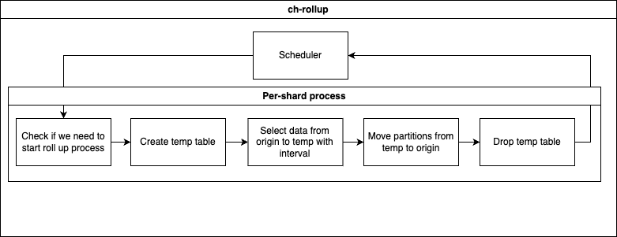

# Design

Here is a design of the **ch-rollup** solution.



What's going on here:

- **Scheduler** starts the roll up process on each shard once an hour (in the future it will be more intelligent and consider the current cluster load).
- **Create temp table** simply creates a copy of the origin table using the ```CREATE TABLE AS``` query.
- **Select data** copies data to the temp table using the ```INSERT SELECT``` statement.
- **Move partitions** copies data from the temp table to the origin table using a [```REPLACE PARTITIONS```](https://clickhouse.com/docs/en/sql-reference/statements/alter/partition#replace-partition) statement.
- **Drop temp table** simply drops temp table using the ```DROP TABLE``` query.